# MSX Nostalgia (good ol' BASIC)
My first computer ever was an [MSX](https://en.wikipedia.org/wiki/MSX), which at the time tried to compete with the ostensibly more popular Commodore 64 and ZX Spectrum. Unlike its competitors, MSX was a standard, and different companies created their own versions in what was the true ancestor of today's PC. My model was (and still is!) a [Sony HB-501p](https://www.msx.org/wiki/Sony_HB-501P).

Anyway, apart from the days spent playing games, my MSX also was my first programming playground. It's there that I moved my first steps, writing different programs in BASIC, saving them on what at the time was my only storage unit: cassettes! Since I'm getting older, I wanted to try and recover most of those somehow, and to my surprise actually managed to do so: some I recovered in their entirety, some only partially, others not at all... but those that I did, I wanted to put somewhere and share them, just for the fun of it.

They're nothing special. Actually, if you give a look at them now, they're probably cr*p! But I look at them and remember my efforts, what I wanted to accomplish and often never did, and how proud I was of most of them. At the end of the day, that's what nostalgia is! And who knows, maybe sooner or later I'll go back at some of them and try to finish what I started.

So just enjoy this dive in my old memories! And if you're feeling brave, try putting them on a real or emulated MSX and give them a spin :smile:

# Recovering them
Before listing the programs, I thought I'd spend a few words on how I recovered most of them, just in case you share a similar past and would like to try and do the same with your old tapes. I basically did two separate things, as in some cases one would work where the other would fail, and viceversa:

1. Imported the old tapes as .wav files, in order to process them with the excellent https://github.com/joyrex2001/castools
2. Bought a [MegaFlashROM SCC+ SD](https://www.msxcartridgeshop.com) cartridge, which works as a regular MSX cartridge but with an SD card you can use for different purposes.

The former was obviously the "easiest" approach. For importing cassettes I used one of those USB "walkmans" you can find around (an ION Audio Tape 2 Go, in my case), recorded the audio with Audacity, and fed it to `wav2cas` from the above mentioned `castools`. It sounds easier than it really is, though: I often had to tweak the audio, cut parts, amplify, reduce noise, etc., just to get something working, and there still is a lot of tape I failed at recovering. I probably have a lot to learn here, as it's a really powerful set of tools.

The latter was a bit more "hardcore", instead! First of all, I had to put my beloved MSX machine back to shape, which wasn't easy: in fact, while it did still work (amazing how a machine that is almost 35 years old can still kick ass!), the recorder seemed busted. With the help of a friend, we managed to clean it up and fix the problem (the recorder belts had melted away, so we replaced them), which meant I could now start loading tapes natively on my MSX again! Once I did that, it was a matter of either trying to load them the old way, or use [tape2cas](https://www.msx.org/news/software/en/trcas-and-tape2cas-martos) to do this in a more automated fashion. This way I did recover some things I couldn't the "easy" way, but it wasn't the solution to all problems anyway: maybe some tapes are just gone and beyond recovery...

Anyway, I'll keep on playing with those tools to recover more, so hopefully this repo will get more updates in the future! Now, about those programs...

# MSX Programs
This is the list of some of the programs I wrote in BASIC when I was a kid. I tried to order them chronologically, although I can't remember if that's indeed correct. I often worked on many at the same time (probably one of the reasons why most were never finished :smile:), and so there may have been some overlap.

All the programs have been saved to ascii format. If you want to test them, e.g., in `openmsx`, you'll either have to add them to a `cas` file, or as part of a virtual disk.

## sherif

  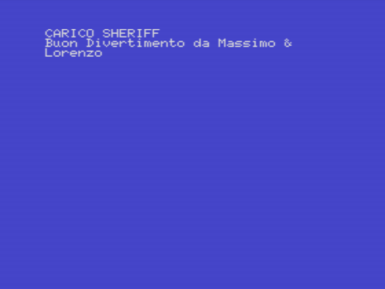

I put this at the beginning, since it's the simplest and dumbest of the bunch. I remember writing this with my older cousin Massimo, who owned an MSX as well (but with a fancy floppy drive I envied a lot) and introduced me to coding. There's nothing Sherif-y in this code: it was simply an opening screen that would then load some existing game! (very much set in the West, I assume)

## lotto

  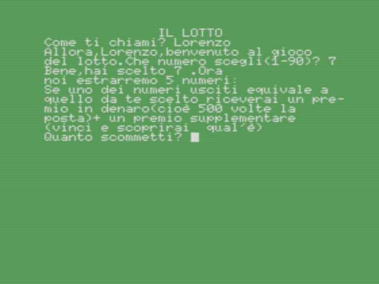

Another of my very early programs. It was a silly one, that randomized a number and would give you a "prize" if you could guess which one it was (although I'm pretty sure the logic was flawed on purpose). The prize was another piece of code I stole from some guide, I believe: a night sky that would slowly fill with stars of different colors, an effect I really loved at the time. 

## toctoc

  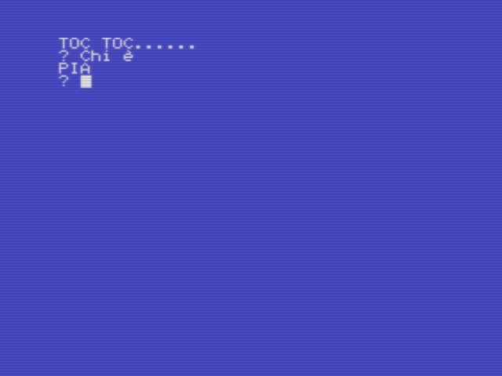

This is actually a cringy "joke" machine. It's a variant of the usual "knock knock" joke, and has a few combinations in memory. If you understand Italian, you'll probably hate it, as I do now! :smile:

## ilcaso

  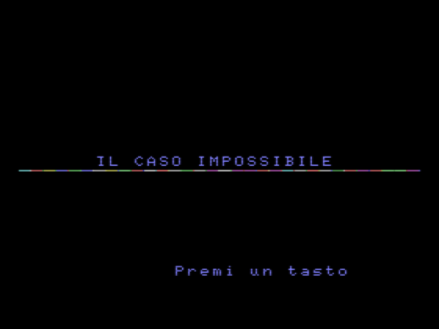

This is a funny one... it has an interesting opening screen (one I used for more than one "game" actually), a fascinating "noir" premise, but then it stops immediately. More interestingly, it curses at you if you refuse to answer the phone! I'm pretty sure it was an attempt to write a detective game of some sort (maybe as a text adventure, something I'd do later on in a different setting) that never took off.

## ita90

  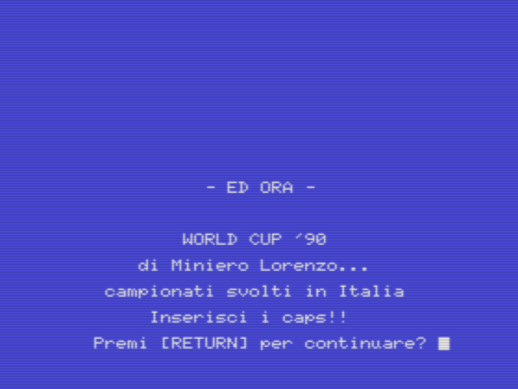

I *love* football, and of course I was fascinated by the World Cup we hosted in Italy in 1990. A friend owned a "manager" kind of game on the C64 set in Mexico'86, and I was obsessed with it. This was my lame attempt at doing the same kind of thing. Lame because, when it asked which team you wanted to play, it didn't use something like an array, but actually asked you to insert the name! Which means you could have "Lorenzo vs. COLOMBIA". Then, you were always in the same group with the same teams. And all results were completely random. But it was fun to write, and did have concepts like group standings and stuff like that. I would later expand on it in a much better (but still flawed) game.

## recit2

  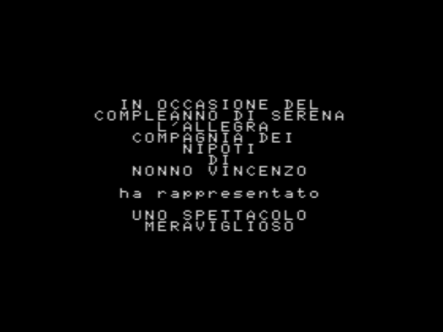

This must have been for the 2nd or 3rd birthday of my youngest sister. My mother organized a small play, involving kids from the whole family (I have many cousins!). My father taped it all, and we decided to write some simple screens to act as credits for the whole thing. Very simple, but I felt it was really cool!

## serena

  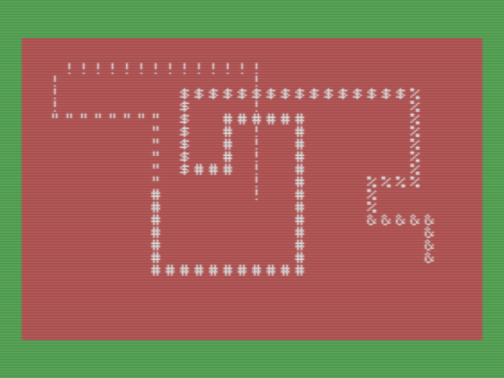

Serena is the name of that youngest sister of mine. Not sure if this was done for that same birthday or later, but I remember writing this for her, as a very simple drawing tool she could play with. The program is really simple: the cursor keys move the character around to draw it, while the function keys change some properties (e.g., current character and colors). Nothing fancy, but it did keep her busy!

## s-lund

  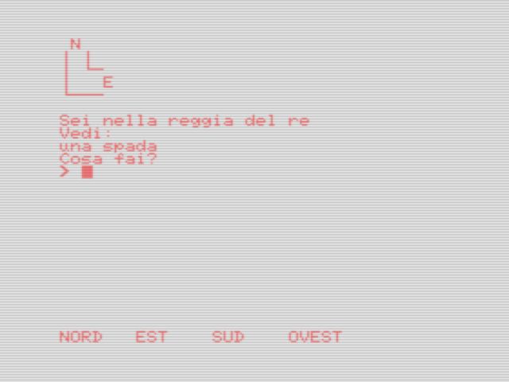

This must have been the project I was proudest of at the time: a fantasy text adventure! As a kid I loved [gamebooks](https://en.wikipedia.org/wiki/Gamebook), and a fantasy series in particular, called "Lupo Solitario". I loved the "Willow" movie as well. I basically ended up ripping off stuff from both of them for this IF game I called Summerlund. It was very simple, and the parser wasn't advanced at all, but it was functional, and I loved it: it even had some simple configuration property to show different characters and colors depending on the room you were in (e.g., green trees on a black background if you were in the forest). Unfortunately, although I distinctly remember finishing it, I could only recover what looks like the very first rooms. Years later I ported this to Amiga and Visual Basic on my first PC as well, so maybe I'll be able to recover those at least.

## utl(1)

  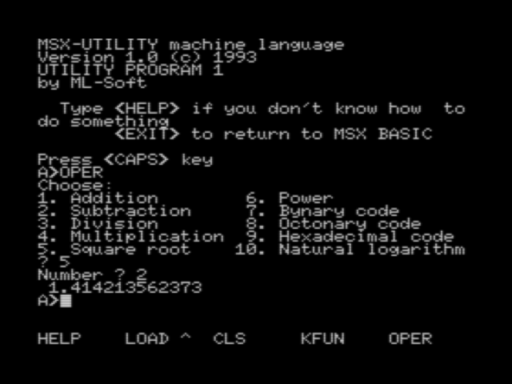

This is quite silly, but I remember writing this when I got my first experience with MS-DOS on a machine at school, where they teached us Pascal. It was a simple attempt at recreating an utility software: the fact there's a "1" there seems to suggest there were others, but I can't remember if that ever happened. I do remember trying to write an MS-DOS "clone" in BASIC (which is even sillier, since I later found out MSX does support DOS!), but I haven't recovered that attempt yet.

## goal

  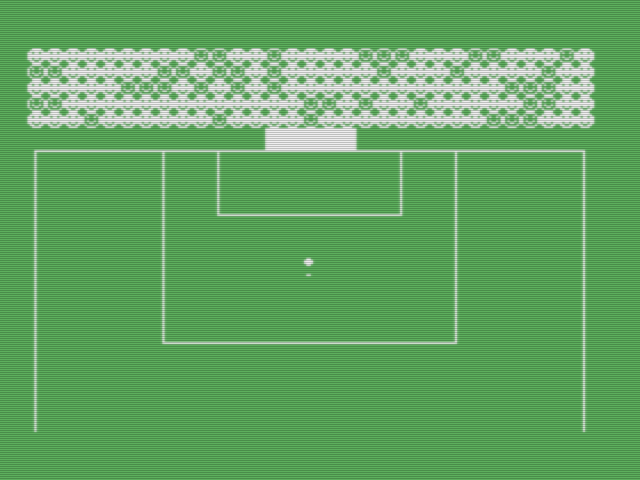

Did I mention how much I love football? This was a very shy attempt at writing an arcade football game. Of course, that never went anywhere, and all I did was writing the title screen (that I very likely ripped off from some BASIC program someone else wrote and shared on one of those code magazines) and drawing a moving field in ugly ascii.

## manage

  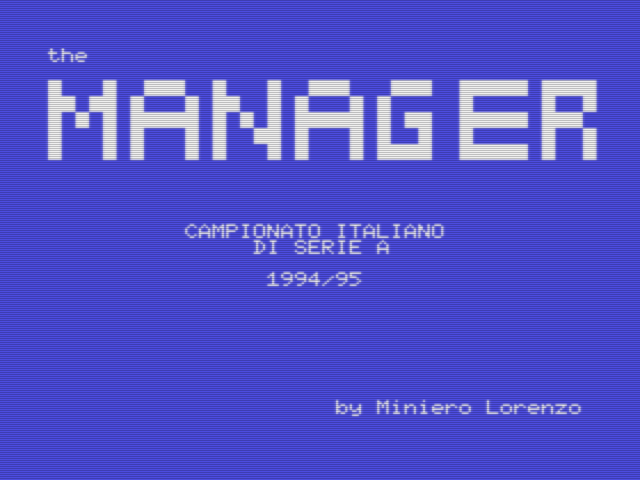

A couple of years after writing the ITA'90 game, a friend showed me "The Manager" on his Amiga. Needless to say, I was mesmerized, and WANTED something similar on my much less equipped MSX. I wrote this HUGE game, that had the names of all the teams and players of that year in the Italian Serie A: you could sell players, buy them, exchange them, and so on; you could choose the team to play each match; each round you'd see text highlights in "real-time" for each match, with proper names, and at the end of each game, a newspaper would review your efforts. It all sounds awesome, but it had the same basic flow as ITA'90: everything was completely randomized, which means you could get Ascoli win the league, and Juventus relegating to Serie B (where they belong, but that's another story...).

Most importantly, since I had now learned how to use arrays properly, I put *a lot* of stuff in memory. As a result, it often resulted in "Out of memory" errors. Pretty sure it only worked as my MSX had no extension an so got the max 28815 bytes for BASIC, which isn't the norm at all. As such, it might be tricky to get it to run for testing, but give it a try!

## sprite

  

After writing a lot of text-based stuff, I eventually learned how sprites worked in the MSX, and I remember spending days drawing them in my squared notebook to see which ones would be 1s and which ones would be 0 in each row. This program here was a simple attempt at testing sprite collision: a bullet would run towards a man, and the "man" sprite would change when hit. It sometimes works, sometimes doesn't... but it felt pretty cool when it did!

## jurass

  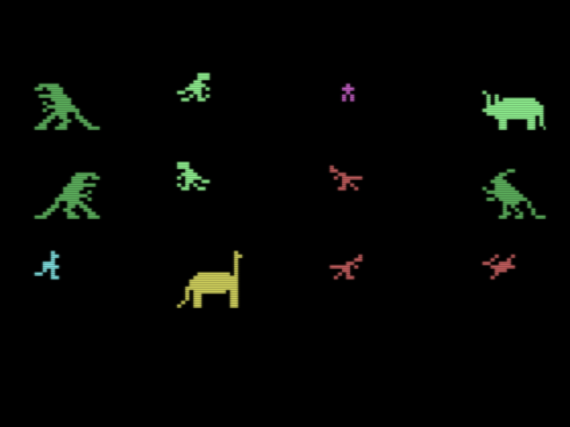

As soon as I started figuring out sprites, I played A LOT with them. This was about the time the first Jurassic Park came out, which I was obsessed with, and so I really wanted to write a game set in that world. I designed sprites for many of the things I wanted there, and this program was a test to see if I could show them together, and how. Needless to say, the game itself never happened.

## ninja

  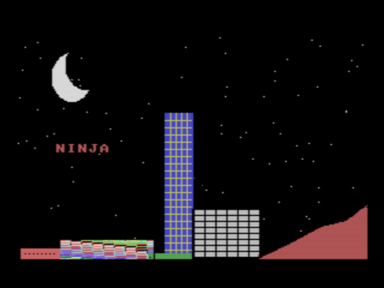

If you were a kid in the late 80s / early 90s, you probably also loved ninjas as much as I did. There were a lot of crappy and cringy movies with ninjas wearing uniforms of different colors, and for some reason I loved those. As such, I wanted to write a game where you'd control a ninja, and have him traverse different screens in an interesting story. This program here was supposed to be the title/loading screen.

## ninjag

  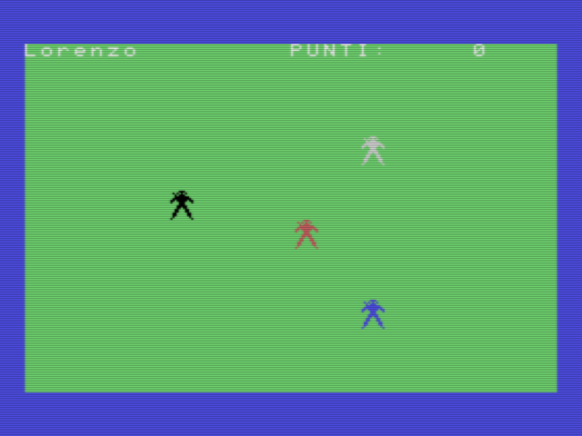

After the loading screen, you'd get the "game" itself. I reused the same sprite in different colors for the main character (in black) and the enemies. This was probably the first game where you could actually move the sprite around, using the cursor keys. Hitting right+down also showed a basic animation (a kick), that really didn't do anything, though. Another game that never went anywhere, unfortunately!

## sub

  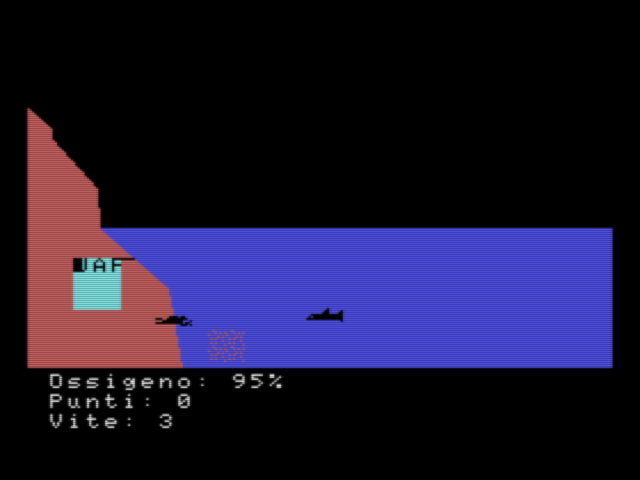

This was probably my most ambitious project. An explorative game, where you'd control a sub navigating the seas in search of some objects. I drew all the screens and how they were connected on paper (I guess it's still somewhere, probably!), and there even was a sunk galleon you could explore.

Anyway, my first experiments were not that good. I drew sprites for the sub, a small flock of fish, and a shark, where you'd control the sub and the others would move on their own. The shark in particular was designed to chase you. My poor knowledge of event loops, though, made it all very slow and choppy. Not sure how far I went with the other screens!
